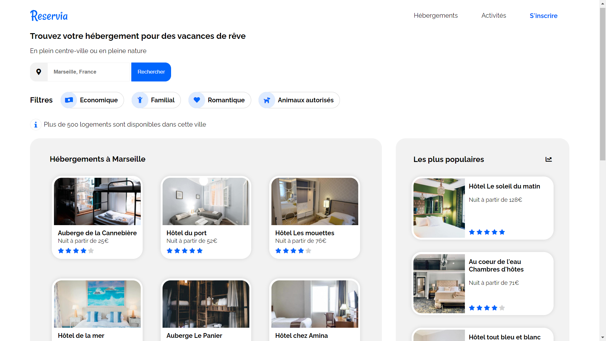

# Reservia

    Projet fictif de formation n°01/11 | OpenClassrooms

<kbd></kbd>

> BESOIN

L'outil de planification de vacances Reservia permet aux usagers de trouver des hébergements et des activités dans la ville de leur choix. Les hébergements peuvent être filtrés par thématique (budget, ambiance) et par spécificités (animaux autorisés ou non)

## Livrable

Intégration responsive HTML + CSS du nouveau design de leur site Internet one page, basé sur les principes du Material Design

## Compétences développées

- [x] Utiliser un système de gestion de versions pour le suivi du projet et son hébergement
- [x] Mettre en place son environnement Front-End
- [x] Intégrer du contenu conformément à une maquette
- [x] Implémenter une interface responsive

## Ressources fournies

> Images

- logo (.svg, .png)
- photos hébergements (.jpg, formats petit, moyen, grand, très grand, résolution 72 dpi)
- photos sites touristiques (.jpg, formats petit, moyen, grand, très grand, résolution 72 dpi)

> Éléments de la charte graphique

- font (Raleway)
- couleurs (bleu #0065FC, bleu clair #DEEBFF, gris #F2F2F2)

> Compléments à apporter

- constitution de la banque d'icones (issues de la bibliothèque Fontawesome)
- adaptation de l'intégration aux tablettes
